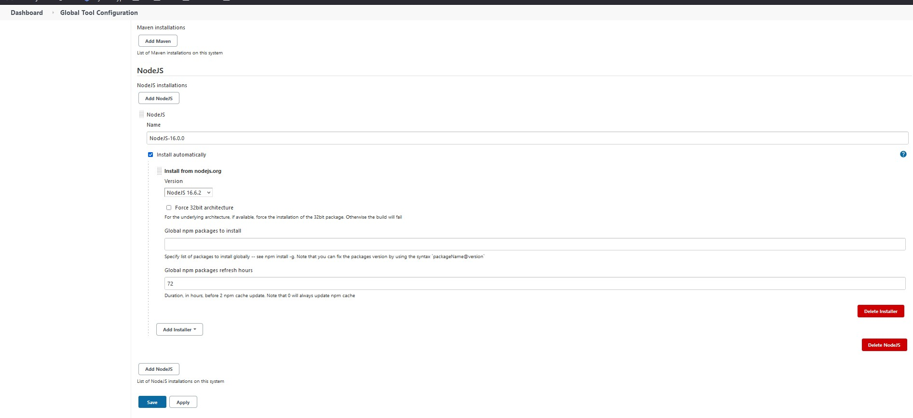
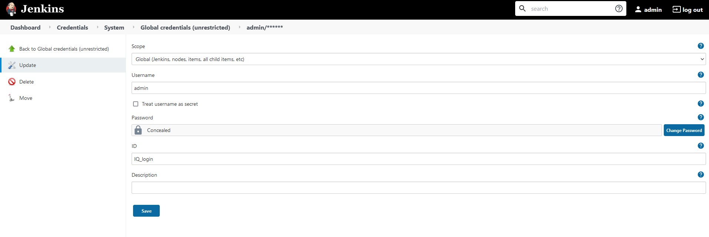
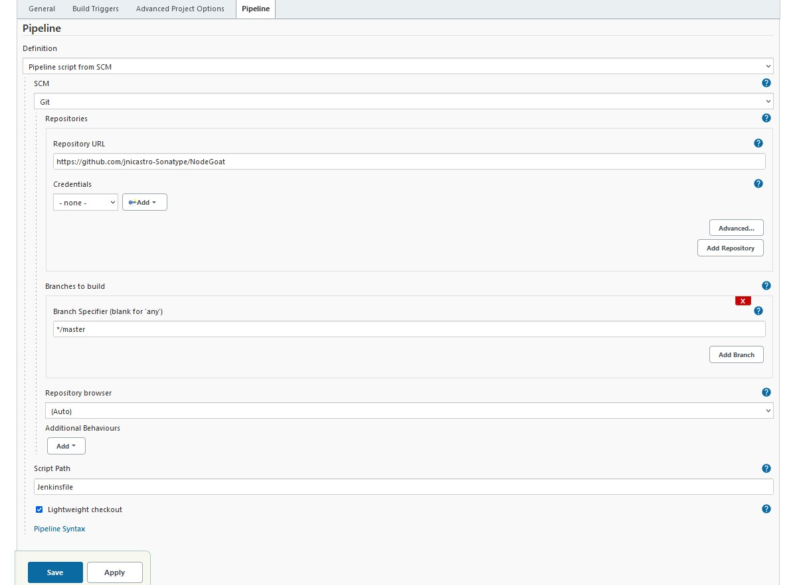
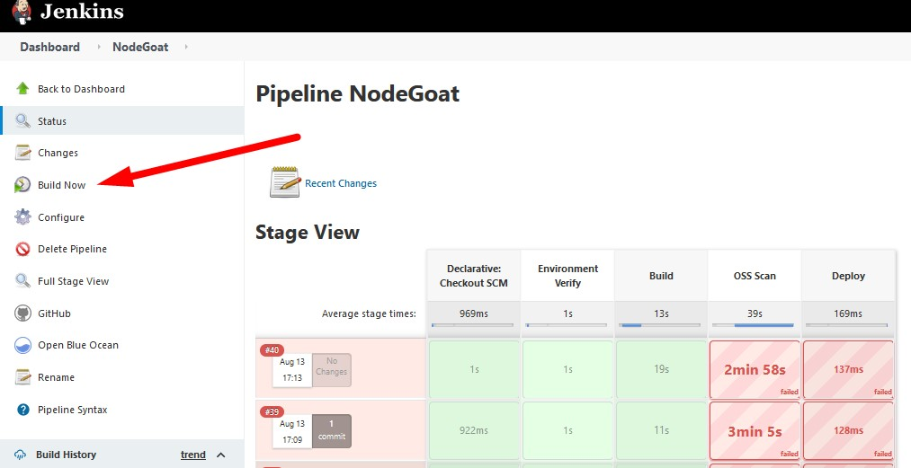

# Introduction

This project is designed to show the complete SDLC with all of our Veracode tools used at the appropriate places in the build process.  This complete process will include:

* building and packaging the app for scanning
* Veracode scanning of first party code
* Veracode SCA scanning of third-party code
* building a Docker image for deployment and Veracode dynamic scanning (coming in the future)

This is a Veracode-specific readme file.  For the original, see README-original.md.

# How to use this

You have 3 options:

1. build from the existing repo (not making any modifications)
2. create a copy (fork) the existing repo for the ability to make your own mods and then build your modified copy
3. just deploy the existing app for dynamic scanning (coming in the future...)

## Option 1 - Build from the existing repo

The instructions below assume you are building using the Jenkins installed on your Windows machine (2019.4 or later).  Note that it is also possible to build on your Mac or a linux machine (although using the linux instance in the Demo Labs is discouraged due to the size of the disk - the Docker image is ~ 1.2G).

### 1. Get Jenkins ready

You will need the following plugins added to Jenkins, beyond what's already here in the 2019.4 images:

* Pipeline Utility Steps
* NodeJS
* AnsiColor

Goto Jenkins --> Manage Jenkins --> Manage Plugins and add these

For Windows only, you will probably need to tell git to handle long filenames (you will see an error during the git clean phase of the build about 'filename too long').  To do this, open a Cmd or Powershell prompt and enter:
``` git config --system core.longpaths true``` and then restart Jenkins (http://localhost:8082/restart).  Ignore any scary error messages, reload the page if necessary.  Jenkins will take about a minute to restart.

### 2. Configure the tools

Goto Jenkins --> Manage Jenkins --> Global Tool Configuration and setup the tools

#### 2.1 NodeJS

Add a NodeJS installation like the following (the names are important, so match them). 



### 3. Configure Credentials in Jenkins 

Goto Jenkins --> Manage Jenkins --> Configure Credentials --> Credentials and add the following to the Jenkins store, global domain:

#### 3.1 login

Add a 'username with password' credential with the following:

The username is your IQ_ID and the password is your IQ_Key.  The ID field must be "IQ_Login" (to match the Jenkinsfile).  The Description field can be anything.



### 4. Create the Jenkins job

Create a Jenkins Pipeline job with the following Pipeline section (you can ignore all the other fields):



### 5. Build w/Jenkins

Click Build Now to run the job.



## Deploying 

This step is only needed if you have "Continue on Error" setup, otherwise the OSS scan should fail as there are policy violations NodeGoat which is expected. 
